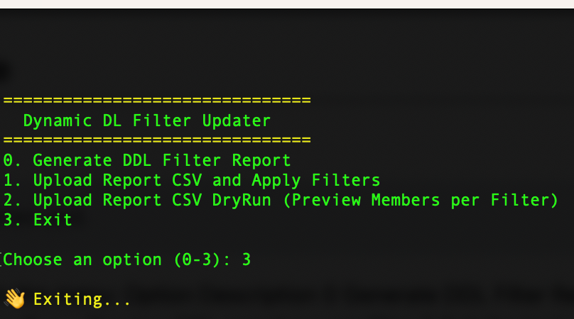

# 📩 Dynamic DL Filter Updater

A PowerShell utility designed for IT administrators to **manage Dynamic Distribution Lists (DDLs)** in Exchange Online. It enables you to **generate reports**, **bulk update recipient filters**, and **preview (dry-run) which users would match those filters**, all via CSV.

---

## 🎯 Features

- ✅ **Generate Report**: Export all DDLs with current filters, readable summaries, and email addresses.
- ✏️ **Edit and Re-Upload**: Modify recipient filters directly in the generated CSV and apply updates in bulk.
- 🔍 **Dry Run**: Simulate filter results and export matching recipients per DDL.
- 🧑‍💼 UPN fallback logic: If `UserPrincipalName` is missing, it falls back to `PrimarySmtpAddress`.

---

## 📂 Output Overview

| File / Folder | Description |
|---------------|-------------|
| `DynamicDL_RecipientFilters_YYYY-MM-DD.csv` | Main report and editable source for updates |
| `DryRun_Results/` | One CSV per DDL showing members matching its filter |

---

## 🧰 Prerequisites

- Windows OS with PowerShell 5.1+
- Exchange Online Management Module  
  ```powershell
  Install-Module ExchangeOnlineManagement -Scope CurrentUser
  ```
---

## 🚀 How to Use

Launch the script:
```powershell
.\DynamicDL_Updater.ps1
```

### 📋 Options Menu

| Option | Description                                               |
|--------|-----------------------------------------------------------|
|   0    | Generate DDL Filter Report (creates a base CSV to edit)   |
|   1    | Upload and Apply Recipient Filters from CSV               |
|   2    | Dry Run – Preview DDL members per filter                  |
|   3    | Exit the tool                                             |




---

## 📢 Use Option 0 first to generate the template, then modify and reuse that same CSV for Options 1 and 2.
🧪 Example Filter

```txt
(Company -eq "Contoso") -and (RecipientTypeDetails -eq "UserMailbox") -and (ExchangeUserAccountControl -ne 'AccountDisabled')
```
You can copy filters from existing DDLs and adapt them as needed.

---

## 🛠 Tech Stack

1. PowerShell
2. Exchange Online Management Module
3. Windows Forms File Dialog

---

## 🤝 Contributions

Feel free to fork, improve, and submit pull requests if you'd like to contribute!

